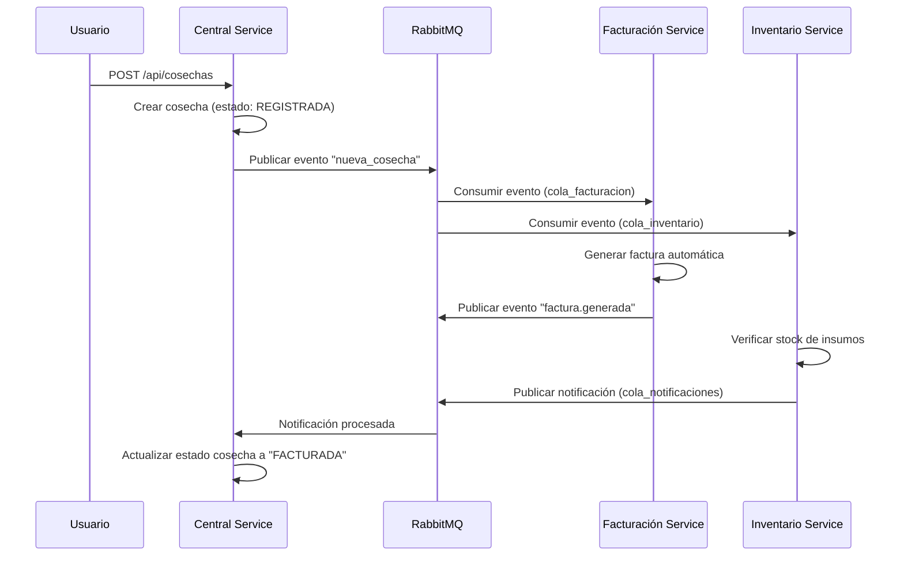

# 🌾 AgroFlow - Sistema de Microservicios para Gestión Agrícola

[](https://openjdk.org/projects/jdk/17/)
[](https://spring.io/projects/spring-boot)
[](https://www.postgresql.org/)
[](https://www.mysql.com/)
[](https://www.rabbitmq.com/)
[](https://www.docker.com/)

## 📋 Descripción

AgroFlow es un sistema distribuido de microservicios diseñado para la gestión integral de procesos agrícolas. El sistema implementa una arquitectura basada en eventos que permite la comunicación asíncrona entre servicios, garantizando escalabilidad y resiliencia.

### 🏗️ Arquitectura del Sistema

```
┌─────────────────┐    ┌─────────────────┐    ┌─────────────────┐
│  Central Service │    │Facturación Serv.│    │ Inventario Serv.│
│    (Port 8080)   │    │   (Port 8082)   │    │   (Port 8081)   │
│                 │    │                 │    │                 │
│ • Agricultores  │    │ • Facturas      │    │ • Insumos       │
│ • Cosechas      │    │ • Pagos         │    │ • Stock         │
│ • Eventos       │    │ • QR Codes      │    │ • Notificaciones│
└─────────┬───────┘    └─────────┬───────┘    └─────────┬───────┘
          │                      │                      │
          └──────────────────────┼──────────────────────┘
                                 │
                    ┌─────────────▼─────────────┐
                    │       RabbitMQ           │
                    │   Message Broker         │
                    │                          │
                    │ • Exchange: cosechas     │
                    │ • Queue: cola_facturacion│
                    │ • Queue: cola_inventario │
                    │ • Queue: cola_notificaciones│
                    └──────────────────────────┘
```

### 🔧 Microservicios

#### 🌱 Central Service (Puerto 8080)
**Base de Datos:** PostgreSQL - `agroflow_central`
- **Gestión de Agricultores**: CRUD completo con validaciones
- **Gestión de Cosechas**: Registro y seguimiento de estados
- **Event Publisher**: Publica eventos de nuevas cosechas via RabbitMQ
- **Entidades**:
  - `Agricultor`: nombre, finca, ubicación, correo, fecha_registro
  - `Cosecha`: producto, toneladas, estado, agricultor_id, factura_id

#### 💰 Facturación Service (Puerto 8082)
**Base de Datos:** PostgreSQL - `agroflow_facturacion`
- **Generación Automática**: Facturas automáticas al recibir eventos de cosecha
- **Gestión de Pagos**: Control de estado de facturas y métodos de pago
- **Códigos QR**: Generación automática para identificación
- **Event Consumer**: Consume eventos de cosechas desde RabbitMQ
- **Entidades**:
  - `Factura`: cosecha_id, monto_total, pagado, fecha_emision, metodo_pago, codigo_qr

#### 📦 Inventario Service (Puerto 8081)
**Base de Datos:** MySQL - `db_inventario`
- **Gestión de Insumos**: Control de stock y categorización
- **Alertas de Stock**: Notificaciones automáticas por stock mínimo
- **Event Processor**: Procesa eventos de cosechas para ajustar inventario
- **Notificaciones**: Sistema de alertas via RabbitMQ
- **Entidades**:
  - `Insumo`: nombre, stock, unidad_medida, categoria, precio_unitario, stock_minimo

## 🚀 Tecnologías y Herramientas

### Backend
- **Java 17**: Lenguaje de programación principal
- **Spring Boot 3.2.0**: Framework de desarrollo
- **Spring Data JPA**: Persistencia y ORM
- **Spring AMQP**: Integración con RabbitMQ
- **Maven**: Gestión de dependencias y build

### Bases de Datos
- **PostgreSQL 14**: Para Central Service y Facturación Service
- **MySQL 8.0**: Para Inventario Service
- **JPA/Hibernate**: ORM con generación automática de esquemas

### Mensajería
- **RabbitMQ 3.12**: Message broker para comunicación asíncrona
- **Topic Exchange**: Patrón de routing para eventos
- **Durable Queues**: Persistencia de mensajes

### Containerización y Orquestación
- **Docker**: Containerización de aplicaciones
- **Docker Compose**: Orquestación local
- **Kubernetes**: Despliegue en producción (manifiestos incluidos)

## ⚙️ Configuración y Ejecución

### 📋 Prerrequisitos
- **Java 17** o superior
- **Maven 3.6+**
- **Docker** y **Docker Compose**
- **Git** para clonar el repositorio

### 🐳 Opción 1: Ejecución con Docker (Recomendado)

1. **Clonar el repositorio**
```bash
git clone <repository-url>
cd examen3P
```

2. **Levantar infraestructura**
```bash
# Iniciar RabbitMQ
docker-compose up -d

# Verificar que los servicios estén corriendo
docker-compose ps
```

3. **Construir y ejecutar servicios**
```bash
# Construir todos los servicios
mvn clean install

# Ejecutar cada servicio en terminales separadas
# Terminal 1 - Central Service
cd central-service && mvn spring-boot:run

# Terminal 2 - Facturación Service  
cd facturacion-service && mvn spring-boot:run

# Terminal 3 - Inventario Service
cd ms-inventario && mvn spring-boot:run
```

### ☸️ Opción 2: Despliegue en Kubernetes

```bash
# Aplicar manifiestos en orden
kubectl apply -f kubernetes/1namespace.yml
kubectl apply -f kubernetes/2database.yml
kubectl apply -f kubernetes/3rabbitmq.yml
kubectl apply -f kubernetes/4deployment.yml
kubectl apply -f kubernetes/5service.yml
kubectl apply -f kubernetes/6ingress.yml

# Verificar despliegue
kubectl get pods -n agroflow
```

### 🔍 Verificación del Sistema

#### RabbitMQ Management Console
- **URL**: http://localhost:15672
- **Usuario**: `admin`
- **Contraseña**: `admin`

#### Health Checks
```bash
# Central Service
curl http://localhost:8080/api/agricultores

# Facturación Service  
curl http://localhost:8082/api/facturas

# Inventario Service
curl http://localhost:8081/api/inventario/insumos
```

## 📚 API Documentation

### 🌱 Central Service (http://localhost:8080)

#### Gestión de Agricultores
| Método | Endpoint | Descripción | Body Example |
|--------|----------|-------------|--------------|
| `GET` | `/api/agricultores` | Listar todos los agricultores | - |
| `GET` | `/api/agricultores/{id}` | Obtener agricultor por ID | - |
| `POST` | `/api/agricultores` | Crear nuevo agricultor | `{"nombre": "Juan Pérez", "finca": "La Esperanza", "ubicacion": "Quito", "correo": "juan@email.com"}` |
| `PUT` | `/api/agricultores/{id}` | Actualizar agricultor | `{"nombre": "Juan Pérez", "finca": "La Esperanza", "ubicacion": "Quito", "correo": "juan@email.com"}` |
| `DELETE` | `/api/agricultores/{id}` | Eliminar agricultor | - |

#### Gestión de Cosechas
| Método | Endpoint | Descripción | Body Example |
|--------|----------|-------------|--------------|
| `GET` | `/api/cosechas` | Listar todas las cosechas | - |
| `GET` | `/api/cosechas/{id}` | Obtener cosecha por ID | - |
| `POST` | `/api/cosechas` | Crear nueva cosecha (🚀 **Dispara evento RabbitMQ**) | `{"agricultorId": "uuid", "producto": "Maíz", "toneladas": 15.5}` |
| `PUT` | `/api/cosechas/{id}/estado` | Actualizar estado de cosecha | `{"estado": "FACTURADA", "facturaId": "uuid"}` |
| `DELETE` | `/api/cosechas/{id}` | Eliminar cosecha | - |

### 💰 Facturación Service (http://localhost:8082)

#### Gestión de Facturas
| Método | Endpoint | Descripción | Body Example |
|--------|----------|-------------|--------------|
| `GET` | `/api/facturas` | Listar todas las facturas | - |
| `GET` | `/api/facturas/{id}` | Obtener factura por ID | - |
| `GET` | `/api/facturas/pendientes` | Listar facturas pendientes de pago | - |
| `PUT` | `/api/facturas/{id}/pagar` | Marcar factura como pagada | `{"metodoPago": "EFECTIVO"}` |
| `POST` | `/api/facturas/manual` | Crear factura manual (para pruebas) | `{"cosechaId": "uuid", "montoTotal": 1500.00}` |

### 📦 Inventario Service (http://localhost:8081)

#### Gestión de Insumos
| Método | Endpoint | Descripción | Body Example |
|--------|----------|-------------|--------------|
| `GET` | `/api/inventario/insumos` | Listar todos los insumos | - |
| `GET` | `/api/inventario/insumos/{id}` | Obtener insumo por ID | - |
| `GET` | `/api/inventario/insumos/disponibles` | Listar insumos disponibles | - |
| `GET` | `/api/inventario/insumos/stock-bajo` | Listar insumos con stock bajo | - |
| `POST` | `/api/inventario/insumos` | Crear nuevo insumo | `{"nombreInsumo": "Semilla Maíz L-23", "stock": 100, "unidadMedida": "kg", "categoria": "Semillas", "precioUnitario": 25.50, "stockMinimo": 20}` |
| `PUT` | `/api/inventario/insumos/{id}` | Actualizar insumo | `{"nombreInsumo": "Semilla Maíz L-23", "stock": 150, "precioUnitario": 27.00}` |
| `PUT` | `/api/inventario/insumos/{id}/stock` | Actualizar solo stock | `{"cantidad": 50, "operacion": "INCREMENTAR"}` |
| `DELETE` | `/api/inventario/insumos/{id}` | Eliminar insumo | - |

## 🔄 Flujo de Eventos (Event-Driven Architecture)

### 📊 Diagrama de Flujo de Eventos



### 🎯 Configuración de RabbitMQ

#### Exchange y Routing
- **Exchange**: `cosechas` (Topic Exchange)
- **Routing Keys**:
  - `nueva`: Para eventos de nuevas cosechas
  - `factura.generada`: Para notificaciones de facturas generadas

#### Colas (Queues)
- **`cola_facturacion`**: Recibe eventos de nuevas cosechas para facturación
- **`cola_inventario`**: Recibe eventos de cosechas para gestión de inventario  
- **`cola_notificaciones`**: Recibe notificaciones del sistema

### 🔄 Estados de Cosecha
1. **`REGISTRADA`**: Estado inicial al crear una cosecha
2. **`FACTURADA`**: Después de generar la factura automáticamente
3. **`PAGADA`**: Cuando se confirma el pago de la factura

## 🧪 Casos de Uso y Pruebas

### 📝 Flujo Completo de Prueba

1. **Crear un Agricultor**
```bash
curl -X POST http://localhost:8080/api/agricultores \
-H "Content-Type: application/json" \
-d '{
  "nombre": "Carlos Mendoza",
  "finca": "El Paraíso",
  "ubicacion": "Ambato, Ecuador",
  "correo": "carlos.mendoza@email.com"
}'
```

2. **Registrar una Cosecha** (🚀 Dispara eventos automáticos)
```bash
curl -X POST http://localhost:8080/api/cosechas \
-H "Content-Type: application/json" \
-d '{
  "agricultorId": "{agricultor-id}",
  "producto": "Arroz",
  "toneladas": 8.5
}'
```

3. **Verificar Factura Generada**
```bash
curl http://localhost:8082/api/facturas
```

4. **Verificar Estado de Inventario**
```bash
curl http://localhost:8081/api/inventario/insumos/stock-bajo
```

5. **Confirmar Pago de Factura**
```bash
curl -X PUT http://localhost:8082/api/facturas/{factura-id}/pagar \
-H "Content-Type: application/json" \
-d '{"metodoPago": "TRANSFERENCIA_BANCARIA"}'
```

### 🎯 Escenarios de Prueba Recomendados

#### Escenario 1: Flujo Normal
1. Crear agricultor → Crear cosecha → Verificar factura → Pagar factura

#### Escenario 2: Gestión de Inventario
1. Crear insumos → Registrar cosecha → Verificar alertas de stock bajo

#### Escenario 3: Monitoreo de Eventos
1. Acceder a RabbitMQ Management → Observar colas y mensajes → Verificar bindings

## 🐛 Troubleshooting y Monitoreo

### 🔍 Logs de Aplicación
```bash
# Ver logs en tiempo real
tail -f central-service/logs/application.log
tail -f facturacion-service/logs/application.log  
tail -f ms-inventario/logs/application.log
```

### 📊 Monitoreo de RabbitMQ
- **Management UI**: http://localhost:15672
- **Verificar conexiones activas**
- **Monitorear colas y mensajes**
- **Revisar bindings y exchanges**

### ⚠️ Problemas Comunes

#### Error de Conexión a Base de Datos
```bash
# Verificar que PostgreSQL esté corriendo
docker ps | grep postgres

# Verificar que MySQL esté corriendo  
docker ps | grep mysql
```

#### Error de Conexión RabbitMQ
```bash
# Verificar estado de RabbitMQ
docker ps | grep rabbitmq
curl http://localhost:15672
```

#### Puerto ya en uso
```bash
# Verificar puertos ocupados
netstat -tulpn | grep :8080
netstat -tulpn | grep :8081  
netstat -tulpn | grep :8082
```

## 🚀 Despliegue en Producción

### 📦 Build para Producción
```bash
# Construir todos los servicios
mvn clean package -DskipTests

# Construir imágenes Docker
docker build -t agroflow/central-service:latest ./central-service
docker build -t agroflow/facturacion-service:latest ./facturacion-service
docker build -t agroflow/inventario-service:latest ./ms-inventario
```

### ☸️ Kubernetes Production Ready
```bash
# Aplicar configuraciones de producción
kubectl apply -f kubernetes/production/

# Configurar Ingress para acceso externo
kubectl get ingress -n agroflow
```

## 🤝 Contribución

1. **Fork** el proyecto
2. **Crear** una rama para tu feature (`git checkout -b feature/nueva-funcionalidad`)
3. **Commit** tus cambios (`git commit -m 'Agregar nueva funcionalidad'`)
4. **Push** a la rama (`git push origin feature/nueva-funcionalidad`)
5. **Crear** un Pull Request

## 📄 Licencia

Este proyecto está bajo la licencia MIT. Ver el archivo `LICENSE` para más detalles.

## 👥 Equipo de Desarrollo

- **Desarrollador Principal**: Edgar Gómez
- **Arquitectura**: Microservicios con Spring Boot
- **Universidad**: ESPE - Aplicaciones Distribuidas

---

⭐ **¡Dale una estrella al proyecto si te resulta útil!** ⭐
- `GET /actuator/health` - Estado del servicio

## Flujo del Sistema
1. **App móvil** → POST cosecha al **Microservicio Central**
2. **Central** → Guarda en PostgreSQL y publica evento en RabbitMQ
3. **RabbitMQ** → Enruta mensaje a cola_facturacion e inventario
4. **Microservicio Facturación** → Consume mensaje, calcula monto, crea factura
5. **Microservicio Inventario** → Escucha eventos de cosecha, actualiza stock de insumos
6. **Facturación** → Notifica al Central vía REST API el cambio de estado
7. **Inventario** → Envía notificaciones de stock bajo via RabbitMQ

## Estructura de Bases de Datos

### PostgreSQL Central (Puerto 5432)
- **agricultores**: ID, nombre, finca, ubicación, correo
- **cosechas**: ID, agricultor_id, producto, toneladas, estado, factura_id

### PostgreSQL Facturación (Puerto 5433)
- **facturas**: ID, cosecha_id, monto_total, pagado, fecha_emisión

### MySQL Inventario (Puerto 3306)
- **insumos**: ID, nombre, descripción, cantidad_stock, precio_unitario, categoria

## Precios de Referencia (USD/tonelada)
- Arroz/Arroz Oro: $120
- Café Premium: $300
- Café: $250
- Maíz: $180
- Banano: $90
- Otros productos: $100 (default)